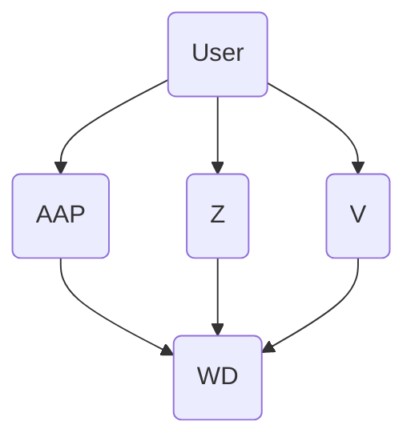
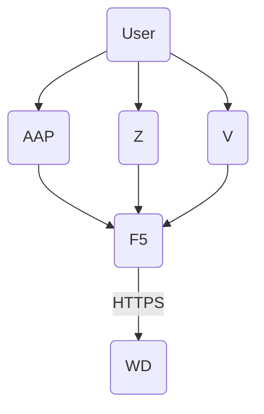

```mermaid

graph TD
A(User) --> B(AAP)
A(User) --> C(Z)
A(User) --> E(V)

B(AAP) --> G(WD)
C(Z) --> G(WD)
E(V) --> G(WD)

```

```mermaid

graph TD
A(User) --> B(AAP)
A(User) --> C(Z)
A(User) --> E(V)

B(AAP) --> F(F5)
C(Z) --> F(F5)
E(V) --> F(F5)
F(F5) -->|HTTPS| G(WD)

```
