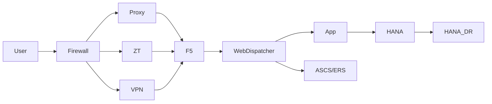
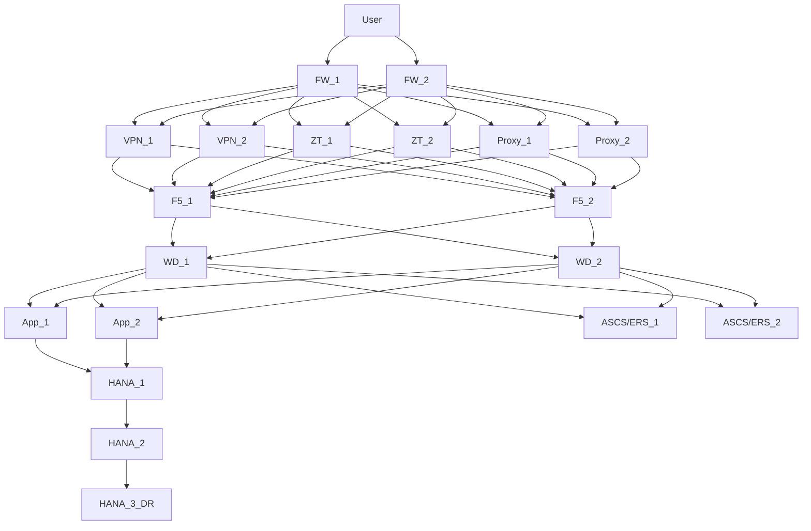
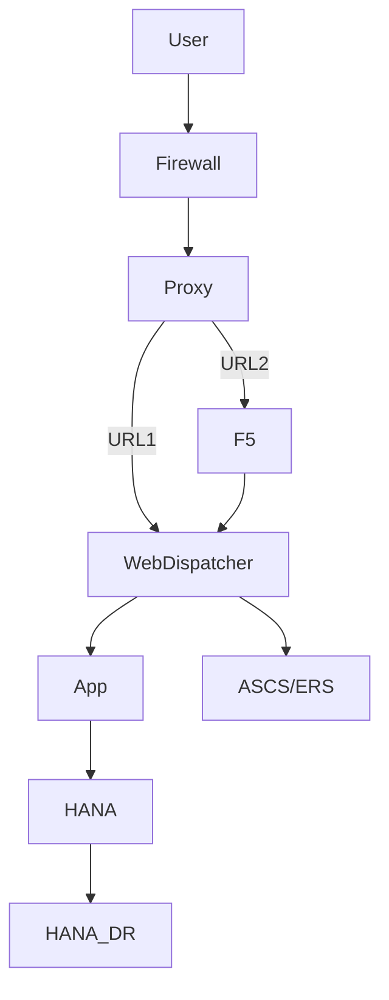

SAP strawman stack example #1

```mermaid
  graph LR
  User-->Firewall
  Firewall-->Proxy
  Firewall-->ZT
  Firewall-->VPN
  Proxy-->F5
  ZT-->F5
  VPN-->F5
  F5-->WebDispatcher
  WebDispatcher-->App
  WebDispatcher-->ASCS/ERS
  App-->HANA
  HANA-->HANA_DR
```

SAP strawman stack example #2

```mermaid
  flowchart TD
  User-->FW_1 & FW_2
  FW_1 & FW_2-->VPN_1 & VPN_2
  FW_1 & FW_2-->ZT_1 & ZT_2
  FW_1 & FW_2-->Proxy_1 & Proxy_2
  VPN_1 & VPN_2-->F5_1 & F5_2
  ZT_1 & ZT_2-->F5_1 & F5_2
  Proxy_1 & Proxy_2-->F5_1 & F5_2
  F5_1 & F5_2-->WD_1 & WD_2
  WD_1 & WD_2-->App_1 & App_2
  WD_1 & WD_2-->ASCS/ERS_1 & ASCS/ERS_2
  App_1 & App_2-->HANA_1
  HANA_1-->HANA_2
  HANA_2-->HANA_3_DR
```

SAP strawman stack example #3

```mermaid
  flowchart TD
  User-->Firewall
  Firewall-->Proxy
  Proxy--URL2-->F5
  Proxy--URL1-->WebDispatcher
  F5-->WebDispatcher
  WebDispatcher-->App
  WebDispatcher-->ASCS/ERS
  App-->HANA
  HANA-->HANA_DR
```
